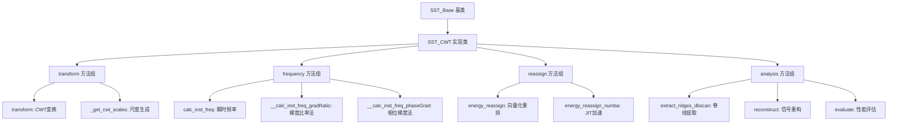
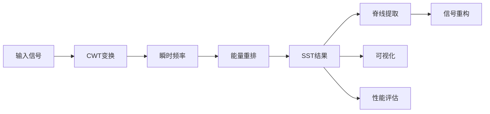
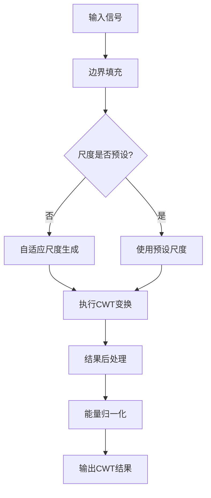
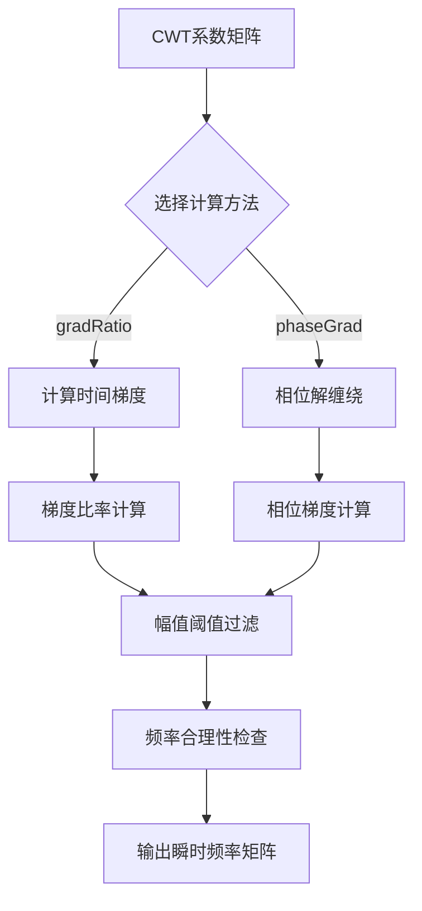
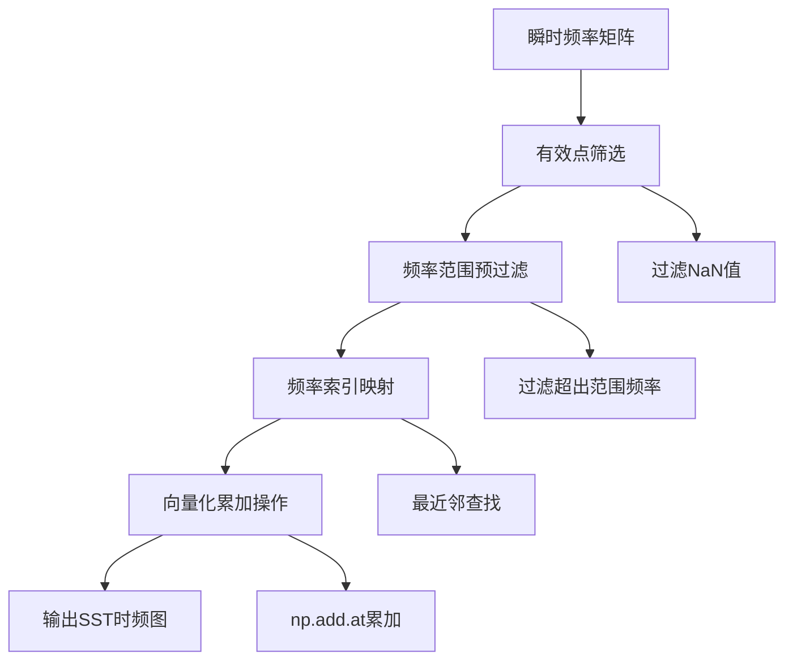
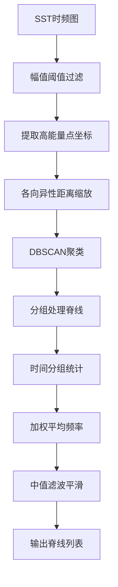
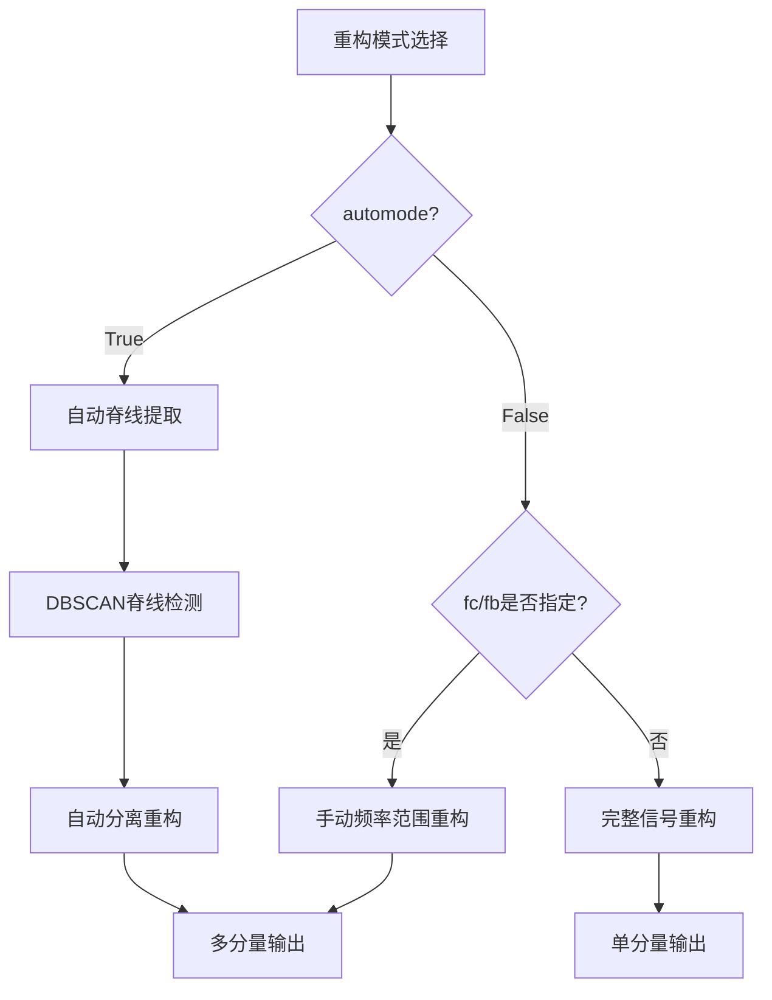

# SST_CWT算法技术说明文档

## 目录

1. [概述](#概述)
2. [算法理论基础](#算法理论基础)
3. [代码设计架构](#代码设计架构)
4. [算法实现详解](#算法实现详解)
5. [使用示例](#使用示例)
6. [性能优化](#性能优化)
7. [常见问题与解决方案](#常见问题与解决方案)

## 概述

### 算法简介

同步压缩变换（Synchrosqueezing Transform, SST）是一种高精度的时频分析方法，通过将传统时频变换的系数按瞬时频率重新分配，实现时频表示的压缩和集中化。本实现基于连续小波变换（CWT）构建SST算法，适用于非平稳信号的时频分析和多分量信号分离。

### 主要特性

本SST_CWT实现在常规算法基础上提供了以下独特特性：

- **自适应尺度生成**：根据信号长度和采样率自动确定最优CWT尺度分布
- **多种瞬时频率算法**：提供梯度比率法和相位梯度法，适应不同信号特征
- **向量化能量重排**：使用numpy向量化操作替代传统循环，显著提升计算效率
- **DBSCAN脊线提取**：基于机器学习聚类算法自动识别频率脊线，无需手动设定
- **多模态信号重构**：支持自动分离重构和手动频率范围指定两种模式
- **Numba JIT加速**：可选的即时编译加速，大数据处理性能提升5-10倍
- **智能平滑处理**：形态学滤波结合高斯平滑，针对时频图特性优化
- **调试可视化模式**：内置调试图表，直观展示算法各步骤效果

### 调用方法

SST_CWT类提供以下主要外部调用接口：

```python
from sst_cwt_module import SST_CWT

# 1. 基础时频分析
sst = SST_CWT(signal, fs)  # 初始化
result = sst.sst()  # 执行完整SST变换
sst.plot(type="sst")  # 绘制结果

# 2. 多分量分离
ridges = sst.extract_ridges_dbscan()  # 提取频率脊线
components = sst.reconstruct(automode=True)  # 自动分离重构

# 3. 性能评估
sparsity_ratio = sst.evaluate()  # 计算稀疏度提升比例

# 4. 手动重构
comp = sst.reconstruct(automode=False, fc=fc_array, fb=fb_array)
```

## 算法理论基础

### SST变换原理

SST变换基于以下数学框架：

1. **CWT变换**：$W_x(a,b) = \frac{1}{\sqrt{a}} \int_{-\infty}^{\infty} x(t) \psi^*\left(\frac{t-b}{a}\right) dt$

2. **瞬时频率计算**：$\omega_x(a,b) = -i \frac{\partial W_x(a,b) / \partial b}{W_x(a,b)}$

3. **能量重排**：$T_x(\omega,b) = \int_{a_0}^{a_1} W_x(a,b) \delta(\omega - \omega_x(a,b)) \frac{da}{a}$

### 算法优势

- **时频分辨率提升**：通过能量重排实现比CWT更锐利的时频表示
- **模态分离能力**：可有效分离频率接近的多分量信号
- **抗噪声干扰**：幅值阈值机制过滤噪声影响

## 代码设计架构

### 整体架构图



### 数据流程图



## 算法实现详解

### 1. transform() - CWT变换实现

#### 功能描述
执行连续小波变换，包含自适应尺度生成、边界处理和能量归一化。

#### 参数配置
- `data` (np.ndarray)：输入信号
- `fs` (float)：采样频率
- `transform_param` (Dict)：CWT参数
  - `wavelet`：小波类型，推荐"cmor10-1"
  - `scalesType`：尺度分布，"log"或"linear"
  - `scalesNum`：尺度数量，建议300-1000

#### 算法流程图



#### 核心代码实现

**1. 边界填充处理**
```python
# 边界填充避免边缘效应
pad_len = len(data) // 10
data_padded = np.pad(data, pad_width=pad_len, mode="reflect")
```

**2. 自适应尺度生成**
```python
@staticmethod
def _get_cwt_scales(fs: float, N: int, scalesType: str, scalesNum: int) -> np.ndarray:
    fn = fs / 2  # Nyquist频率
    f_min = 5 * fs / N  # 最小有意义频率
    
    if scalesType == "log":
        log_fn = np.log10(fn)
        log_f_min = np.log10(f_min)
        log_f_Axis = np.linspace(log_f_min, log_fn, scalesNum)
        f_Axis = np.power(10, log_f_Axis)  # 对数尺度
        scales = fs / f_Axis[::-1]  # 转换为增序尺度
        return scales
```

**3. CWT计算与后处理**
```python
# 执行CWT变换
coeffs, f_Axis = cwt(
    data=data_padded,
    wavelet=wavelet,
    scales=scales,
    sampling_period=t_Axis[1],
    method="fft"
)

# 后处理：频率轴调整、去除填充
coeffs = coeffs[::-1, pad_len:-pad_len]  # 反转并去填充
f_Axis = f_Axis[::-1]  # 频率轴调整为递增

# 能量归一化
data_energy = np.sum(np.abs(data) ** 2)
cwt_energy = np.sum(np.abs(coeffs) ** 2)
coeffs = coeffs * np.sqrt(data_energy / cwt_energy)
```

### 2. calc_inst_freq() - 瞬时频率计算

#### 功能描述
基于CWT系数计算瞬时频率，提供两种算法实现。

#### 算法选择
- `gradRatio`：梯度比率法（推荐），适用于一般信号
- `phaseGrad`：相位梯度法，适用于相位连续性好的信号

#### 算法流程图



#### 梯度比率法实现

```python
def __calc_inst_freq_gradRatio(self, C_x: np.ndarray, t: np.ndarray) -> np.ndarray:
    # 计算时间方向梯度
    dC_x = np.gradient(C_x, t, axis=1)
    
    # 幅值过滤机制
    magnitude = np.abs(C_x)
    threshold = self.gamma * np.max(magnitude)
    mask = magnitude >= threshold
    
    # 瞬时频率计算
    freq_remap = np.full_like(C_x, np.nan, dtype=float)
    if np.any(mask):
        # 核心公式：ω = Im(dC/dt / C) / (2π)
        inst_freq = np.imag(dC_x[mask] / C_x[mask]) / (2 * np.pi)
        
        # 频率合理性检查
        valid_freq_mask = (inst_freq > 0) & (inst_freq < self.fs / 2)
        freq_remap[mask] = np.where(valid_freq_mask, inst_freq, np.nan)
    
    return freq_remap
```

#### 相位梯度法实现

```python
def __calc_inst_freq_phaseGrad(self, C_x: np.ndarray, t: np.ndarray) -> np.ndarray:
    # 相位解缠绕
    phase = np.unwrap(np.angle(C_x), axis=1)
    
    # 计算相位梯度
    dphase_dt = np.gradient(phase, t, axis=1)
    
    # 幅值过滤和正频率筛选
    magnitude = np.abs(C_x)
    threshold = self.gamma * np.max(magnitude)
    mask = magnitude >= threshold
    
    valid_mask = mask & (dphase_dt > 0)
    freq_remap = np.full_like(C_x, np.nan, dtype=float)
    freq_remap[valid_mask] = dphase_dt[valid_mask] / (2 * np.pi)
    
    return freq_remap
```

### 3. energy_reassign() - 能量重排算法

#### 功能描述
将CWT系数按瞬时频率重新分配到正确的频率位置，实现时频压缩。

#### 算法流程图



#### 核心实现代码

**1. 有效点筛选**
```python
# 获取有效的频率重映射点
valid_mask = ~np.isnan(self.inst_freq)

# 预过滤频率范围
f_min, f_max = self.transform_result["f_Axis"][0], self.transform_result["f_Axis"][-1]
freq_range_mask = (self.inst_freq >= f_min) & (self.inst_freq <= f_max)
valid_mask = valid_mask & freq_range_mask
```

**2. 向量化频率映射**
```python
if np.any(valid_mask):
    valid_freq_remap = self.inst_freq[valid_mask]
    valid_coeffs = self.transform_result["tf_map"][valid_mask]
    valid_indices = np.where(valid_mask)
    time_indices = valid_indices[1]
    
    # 查找最近的频率索引
    freq_indices = np.searchsorted(
        self.transform_result["f_Axis"], valid_freq_remap, side="left"
    )
    freq_indices = np.clip(freq_indices, 0, len(self.transform_result["f_Axis"]) - 1)
```

**3. 最近邻优化**
```python
# 向量化最近邻计算
left_indices = np.maximum(freq_indices - 1, 0)
left_dist = np.abs(valid_freq_remap - self.transform_result["f_Axis"][left_indices])
right_dist = np.abs(valid_freq_remap - self.transform_result["f_Axis"][freq_indices])
freq_indices = np.where(left_dist < right_dist, left_indices, freq_indices)

# 向量化累加操作
sst_tf_map = np.zeros_like(self.transform_result["tf_map"], dtype=complex)
np.add.at(sst_tf_map, (freq_indices, time_indices), valid_coeffs)
```

### 4. extract_ridges_dbscan() - 频率脊线提取

#### 功能描述
使用DBSCAN机器学习聚类算法自动识别和提取频率脊线。

#### 参数配置指南
- `amp_thresh_ratio`：幅值阈值比例（0.05-0.2）
- `db_eps`：DBSCAN邻域半径（3-20）
- `db_min_samples`：最小样本数（5-50）

#### 算法流程图



#### 核心实现步骤

**1. 高能量点提取**
```python
# 提取大于阈值的所有点
amp_thresh = amp_thresh_ratio * np.max(tf_map)
idx_f, idx_t = np.where(tf_map > amp_thresh)
points = np.stack([idx_t, idx_f], axis=1)  # [时间索引, 频率索引]
```

**2. 各向异性距离处理**
```python
# 时间和频率轴不同权重
time_weight = 0.1  # 时间轴权重
freq_weight = 1.0  # 频率轴权重
points_scaled = np.copy(points).astype(float)
points_scaled[:, 0] *= time_weight
points_scaled[:, 1] *= freq_weight
```

**3. DBSCAN聚类和脊线处理**
```python
# DBSCAN聚类
db = DBSCAN(eps=db_eps, min_samples=db_min_samples, metric="euclidean")
labels = db.fit_predict(points_scaled)

# 分别处理每条频率脊线
for cluster_id in range(n_clusters):
    mask = labels == cluster_id
    cluster_points = points[mask]
    
    # 按时间分组，统计每个时刻的真实频率
    ridge_freq = np.full(T, np.nan)
    for t in np.unique(cluster_points[:, 0]):
        freq_idx = cluster_points[cluster_points[:, 0] == t, 1]
        # 使用加权平均，权重为对应点的幅值
        weights = tf_map[freq_idx, t]
        freq_val = np.average(f_Axis[freq_idx], weights=weights)
        ridge_freq[t] = freq_val
```

### 5. reconstruct() - 信号重构

#### 功能描述
基于SST结果重构原始信号或分离多个信号分量。

#### 重构模式



#### 实现代码

**1. 自动模式实现**
```python
if automode:
    # 提取频率脊线
    fc_list = np.asarray(self.extract_ridges_dbscan())
    fb_list = np.where(np.isnan(fc_list), 0, self.fb)
    fc_list = np.nan_to_num(fc_list, nan=f_Axis[-1])
    
    # 转换为频率索引
    fc_list, fb_list = self._freqs_to_idx(fc_list, fb_list, f_Axis)
    
    # 执行分离重构
    recons = issq_cwt(
        Tx=self.sst_result["tf_map"],
        wavelet="morlet",
        cc=fc_list.T,  # 中心频率索引
        cw=fb_list.T,  # 带宽索引
    )
    return recons
```

**2. 频率范围转索引映射**
```python
@staticmethod
def _freqs_to_idx(fc: np.ndarray, fb: np.ndarray, f_Axis: np.ndarray) -> Tuple[np.ndarray, np.ndarray]:
    # 计算频率范围边界
    f_low = fc - fb
    f_high = fc + fb
    
    # 查找对应的索引范围
    f_low_idx = np.searchsorted(f_Axis, f_low, side="left")
    f_high_idx = np.searchsorted(f_Axis, f_high, side="right")
    f_low_idx = np.clip(f_low_idx, 0, len(f_Axis) - 1)
    f_high_idx = np.clip(f_high_idx, 0, len(f_Axis) - 1)
    
    # 计算中心索引和带宽索引
    fc_idx = (f_low_idx + f_high_idx) // 2
    fb_idx = (f_high_idx - f_low_idx) // 2
    return fc_idx, fb_idx
```

### 6. evaluate() - 性能评估

#### 功能描述
通过比较SST前后的稀疏度来量化时频压缩效果。

#### 评估原理
使用L1/L2范数比值计算能量集中度：
```python
@staticmethod
def _evaluate_tpMap(tp_map: np.ndarray) -> float:
    Amp = np.abs(tp_map)
    L2 = np.linalg.norm(Amp, ord=2)  # L2范数
    L1 = np.linalg.norm(Amp, ord=1)  # L1范数
    sparsity = L2 / L1  # 稀疏度指标
    return sparsity

def evaluate(self) -> float:
    s1 = self._evaluate_tpMap(self.sst_result["tf_map"])    # SST稀疏度
    s2 = self._evaluate_tpMap(self.transform_result["tf_map"])  # CWT稀疏度
    ratio = s1 / s2  # 稀疏度比率，>1表示SST提高了能量集中度
    return ratio
```

## 使用示例

### 1. 基础时频分析示例

```python
import numpy as np
import matplotlib.pyplot as plt
from sst_cwt_module import SST_CWT

# 生成调频信号
fs = 1000
t = np.linspace(0, 2, 2*fs)
f1 = 50 + 30*np.sin(2*np.pi*0.5*t)  # 50Hz基频 + 正弦调频
signal = np.cos(2*np.pi*np.cumsum(f1)/fs)

# 执行SST分析
sst = SST_CWT(signal, fs, isDebug=True)  # 开启调试模式
result = sst.sst()

# 性能评估
sparsity_ratio = sst.evaluate()
print(f"SST稀疏度提升: {sparsity_ratio:.2f}")

# 绘制对比图
fig, (ax1, ax2) = plt.subplots(1, 2, figsize=(12, 5))

# CWT结果
mesh1 = ax1.pcolormesh(sst.transform_result["t_Axis"], 
                       sst.transform_result["f_Axis"], 
                       np.abs(sst.transform_result["tf_map"]), 
                       shading='auto', cmap='jet')
ax1.set_title('CWT时频图')
ax1.set_xlabel('时间/s')
ax1.set_ylabel('频率/Hz')
plt.colorbar(mesh1, ax=ax1)

# SST结果
mesh2 = ax2.pcolormesh(sst.sst_result["t_Axis"], 
                       sst.sst_result["f_Axis"], 
                       np.abs(sst.sst_result["tf_map"]), 
                       shading='auto', cmap='jet')
ax2.set_title('SST时频图')
ax2.set_xlabel('时间/s')
ax2.set_ylabel('频率/Hz')
plt.colorbar(mesh2, ax=ax2)

plt.tight_layout()
plt.show()
```

### 2. 多分量信号分离示例

```python
# 生成多分量信号
fs = 2000
t = np.linspace(0, 3, 3*fs)

# 分量1：100Hz + 线性调频
f1 = 100 + 20*t  
phase1 = 2*np.pi*np.cumsum(f1)/fs
comp1 = np.cos(phase1)

# 分量2：200Hz固定频率
comp2 = 0.8*np.cos(2*np.pi*200*t)

# 分量3：50Hz + 正弦调频
f3 = 50 + 15*np.sin(2*np.pi*0.3*t)
phase3 = 2*np.pi*np.cumsum(f3)/fs
comp3 = 0.6*np.cos(phase3)

# 合成信号
signal = comp1 + comp2 + comp3 + 0.1*np.random.randn(len(t))

# SST分析和分离
sst = SST_CWT(signal, fs, gamma=0.15, fb=8)
sst.sst()

# 自动分离重构
components = sst.reconstruct(automode=True)
print(f"检测到 {len(components)-1} 个信号分量")

# 分析各分量能量
for i, comp in enumerate(components[:-1]):  # 排除残差
    energy = np.var(comp)
    correlation_1 = np.corrcoef(comp, comp1)[0,1] if len(comp) == len(comp1) else 0
    correlation_2 = np.corrcoef(comp, comp2)[0,1] if len(comp) == len(comp2) else 0
    correlation_3 = np.corrcoef(comp, comp3)[0,1] if len(comp) == len(comp3) else 0
    print(f"分量{i+1}: 能量={energy:.4f}")
    print(f"  与原始分量1相关性: {abs(correlation_1):.3f}")
    print(f"  与原始分量2相关性: {abs(correlation_2):.3f}")
    print(f"  与原始分量3相关性: {abs(correlation_3):.3f}")

# 绘制分离结果
fig, axes = plt.subplots(len(components), 1, figsize=(10, 2*len(components)))
for i, comp in enumerate(components):
    if i < len(components) - 1:
        axes[i].plot(t, comp)
        axes[i].set_title(f'分离分量 {i+1}')
    else:
        axes[i].plot(t, comp)
        axes[i].set_title('残差分量')
    axes[i].set_xlabel('时间/s')
    axes[i].grid(True)

plt.tight_layout()
plt.show()
```

### 3. 手动频率范围重构示例

```python
# 指定感兴趣的频率范围重构特定分量
fs = 1000
t = np.linspace(0, 2, 2*fs)

# 创建包含多个频率成分的信号
signal = (np.cos(2*np.pi*50*t) + 
          0.7*np.cos(2*np.pi*120*t) + 
          0.5*np.cos(2*np.pi*200*t))

# SST分析
sst = SST_CWT(signal, fs)
sst.sst()

# 手动指定频率范围重构
# 重构50Hz附近分量
fc_50 = np.full(len(t), 50)    # 50Hz中心频率
fb_50 = np.full(len(t), 10)    # ±10Hz带宽
comp_50 = sst.reconstruct(automode=False, fc=fc_50, fb=fb_50)

# 重构120Hz附近分量
fc_120 = np.full(len(t), 120)
fb_120 = np.full(len(t), 15)
comp_120 = sst.reconstruct(automode=False, fc=fc_120, fb=fb_120)

# 重构200Hz附近分量
fc_200 = np.full(len(t), 200)
fb_200 = np.full(len(t), 15)
comp_200 = sst.reconstruct(automode=False, fc=fc_200, fb=fb_200)

# 绘制重构结果
fig, axes = plt.subplots(4, 1, figsize=(10, 8))

axes[0].plot(t, signal)
axes[0].set_title('原始信号')
axes[0].grid(True)

axes[1].plot(t, comp_50[0])
axes[1].set_title('50Hz分量重构')
axes[1].grid(True)

axes[2].plot(t, comp_120[0])
axes[2].set_title('120Hz分量重构')
axes[2].grid(True)

axes[3].plot(t, comp_200[0])
axes[3].set_title('200Hz分量重构')
axes[3].grid(True)

for ax in axes:
    ax.set_xlabel('时间/s')

plt.tight_layout()
plt.show()

# 计算重构精度
total_reconstructed = comp_50[0] + comp_120[0] + comp_200[0]
reconstruction_error = np.mean((signal - total_reconstructed)**2)
print(f"重构误差 (MSE): {reconstruction_error:.6f}")
```

### 4. 参数优化示例

```python
# 演示不同参数设置对SST效果的影响
fs = 1000
t = np.linspace(0, 2, 2*fs)

# 创建频率接近的双分量信号（考验分离能力）
f1 = 100  # 第一分量频率
f2 = 115  # 第二分量频率（频率较接近）
signal = np.cos(2*np.pi*f1*t) + 0.8*np.cos(2*np.pi*f2*t)

# 测试不同参数配置
configs = [
    {"gamma": 0.05, "fb": 3, "scalesNum": 300},
    {"gamma": 0.15, "fb": 5, "scalesNum": 500},
    {"gamma": 0.25, "fb": 8, "scalesNum": 800},
]

results = []
for i, config in enumerate(configs):
    print(f"\n测试配置 {i+1}: {config}")
    
    # 配置CWT参数
    cwt_param = {"scalesNum": config["scalesNum"]}
    
    # 创建SST对象
    sst = SST_CWT(signal, fs, 
                  cwt_param=cwt_param,
                  gamma=config["gamma"], 
                  fb=config["fb"])
    
    # 执行SST
    sst.sst()
    
    # 评估性能
    sparsity_ratio = sst.evaluate()
    
    # 尝试分离
    try:
        components = sst.reconstruct(automode=True)
        n_components = len(components) - 1  # 排除残差
    except:
        n_components = 0
    
    results.append({
        "config": config,
        "sparsity_ratio": sparsity_ratio,
        "n_components": n_components
    })
    
    print(f"  稀疏度提升: {sparsity_ratio:.3f}")
    print(f"  检测分量数: {n_components}")

# 输出最佳配置
best_config = max(results, key=lambda x: x["sparsity_ratio"])
print(f"\n最佳配置: {best_config['config']}")
print(f"最佳稀疏度提升: {best_config['sparsity_ratio']:.3f}")
```

## 性能优化

### Numba JIT加速使用

对于大数据量处理，建议启用Numba加速：

```python
# 启用Numba加速
sst = SST_CWT(signal, fs, isNumba=True)

# 性能对比测试
import time

# 测试向量化版本
start_time = time.time()
sst_normal = SST_CWT(signal, fs, isNumba=False)
sst_normal.sst()
normal_time = time.time() - start_time

# 测试Numba加速版本
start_time = time.time()
sst_numba = SST_CWT(signal, fs, isNumba=True)
sst_numba.sst()
numba_time = time.time() - start_time

print(f"向量化版本耗时: {normal_time:.3f}s")
print(f"Numba加速耗时: {numba_time:.3f}s")
print(f"加速比: {normal_time/numba_time:.2f}x")
```

### 内存优化建议

```python
# 对于长时间序列，分段处理
def process_long_signal(signal, fs, segment_length=10):
    """分段处理长时间序列信号"""
    segment_samples = int(segment_length * fs)
    n_segments = len(signal) // segment_samples
    
    results = []
    for i in range(n_segments):
        start_idx = i * segment_samples
        end_idx = start_idx + segment_samples
        segment = signal[start_idx:end_idx]
        
        sst = SST_CWT(segment, fs)
        result = sst.sst()
        results.append(result)
        
        # 清理内存
        del sst
    
    return results
```

## 常见问题与解决方案

### 1. 瞬时频率计算异常

**问题**：瞬时频率包含大量NaN值
**解决方案**：
- 降低gamma阈值（0.05-0.1）
- 检查信号是否包含噪声
- 尝试不同的瞬时频率计算方法

### 2. 脊线提取效果不佳

**问题**：DBSCAN未能正确识别频率脊线
**解决方案**：
- 调整db_eps参数（3-20范围）
- 修改amp_thresh_ratio（0.05-0.3）
- 检查SST结果的时频集中度

### 3. 重构精度不足

**问题**：重构信号与原始信号差异较大
**解决方案**：
- 增加CWT尺度数量（scalesNum）
- 优化频率范围设置（fc, fb参数）
- 检查频率脊线提取质量

### 4. 计算效率问题

**问题**：处理时间过长
**解决方案**：
- 启用Numba加速（isNumba=True）
- 降低尺度数量或信号长度
- 使用分段处理策略
