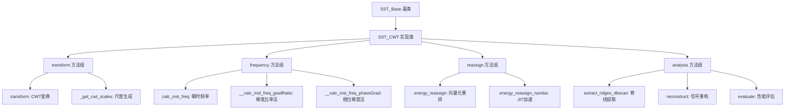
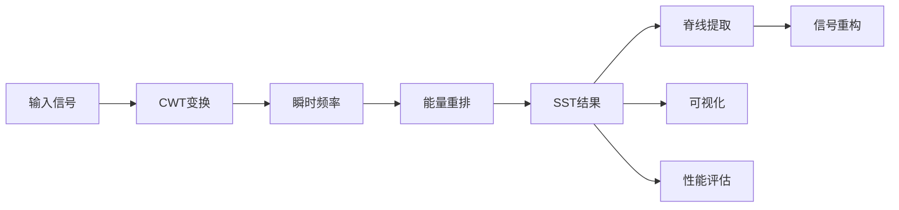
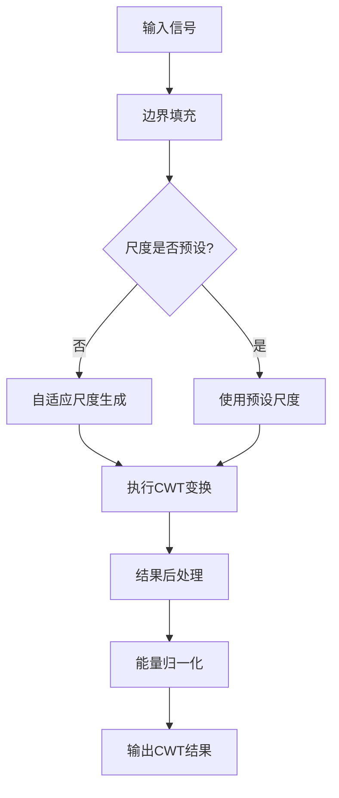
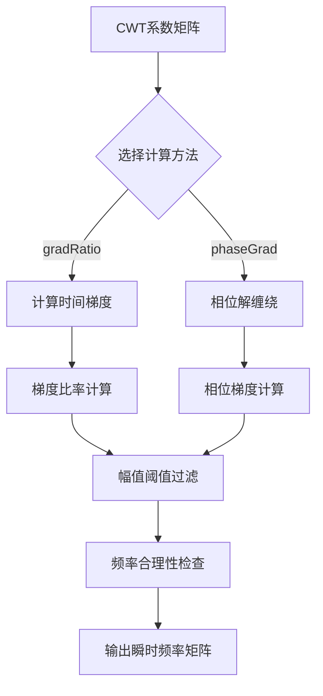
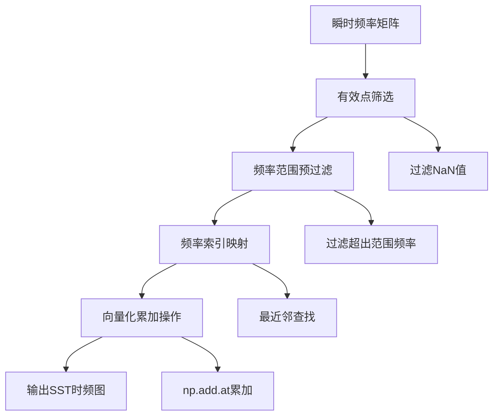
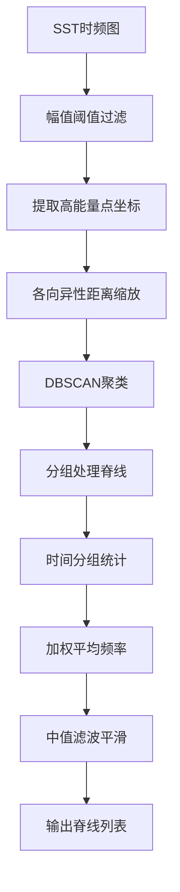
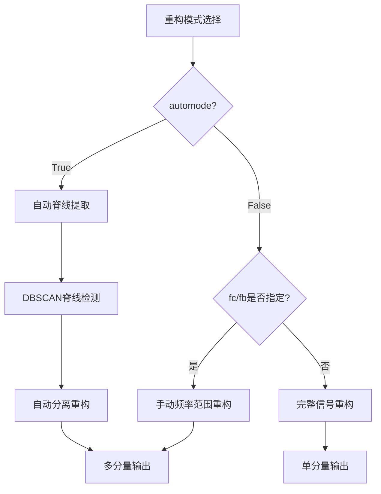

# SST_CWT算法技术说明文档

## 目录

1. [概述](#概述)
2. [代码设计架构](#代码设计架构)
3. [算法实现详解](#算法实现详解)
4. [详细调用方法](#详细调用方法)

## 概述

### 算法简介

同步压缩变换（Synchrosqueezing Transform, SST）是一种高精度的时频分析方法，通过将传统时频变换的系数按瞬时频率重新分配，实现时频表示的压缩和集中化。本实现基于连续小波变换（CWT）构建SST算法，适用于非平稳信号的时频分析和多分量信号分离。

### 主要特性

SST_CWT实现在常规算法基础上提供了以下独特特性：

- **自适应尺度生成**：根据信号长度和采样率自动确定最优CWT尺度分布
- **多种瞬时频率算法**：提供梯度比率法和相位梯度法，适应不同信号特征
- **向量化能量重排**：使用numpy向量化操作替代传统循环，显著提升计算效率
- **DBSCAN脊线提取**：基于机器学习聚类算法自动识别频率脊线，无需手动设定
- **多模态信号重构**：支持自动分离重构和手动频率范围指定两种模式
- **Numba JIT加速**：可选的即时编译加速，大数据处理性能提升5-10倍
- **智能平滑处理**：形态学滤波结合高斯平滑，针对时频图特性优化
- **调试可视化模式**：设置调试模式，直观展示算法各步骤效果

### 简化调用示例

```python
from sst_cwt_module import SST_CWT

# 1. 基础时频分析
sst = SST_CWT(signal, fs)  # 初始化
result = sst.sst()  # 执行完整SST变换
sst.plot(type="sst")  # 绘制结果

# 2. 多分量分离
ridges = sst.extract_ridges_dbscan()  # 提取频率脊线
components = sst.reconstruct(automode=True)  # 自动分离重构

# 3. 性能评估
sparsity_ratio = sst.evaluate()  # 计算稀疏度提升比例

# 4. 手动重构
comp = sst.reconstruct(automode=False, fc=fc_array, fb=fb_array)
```

## 代码设计架构

### 整体架构图



### 数据流程图



## 算法实现详解

### 1. transform() - CWT变换实现

#### 功能描述
执行连续小波变换，包含自适应尺度生成、边界处理和能量归一化。

#### 参数配置

- `data` (np.ndarray)：输入信号
- `fs` (float)：采样频率
- `transform_param` (Dict)：CWT参数
  - `wavelet`：小波类型，推荐"cmor10-1"
  - `scalesType`：尺度分布，"log"或"linear"
  - `scalesNum`：尺度数量，建议300-1000

#### 算法流程图



#### 核心代码实现

**1. 边界填充处理**
```python
# 边界填充避免边缘效应
pad_len = len(data) // 10
data_padded = np.pad(data, pad_width=pad_len, mode="reflect")
```

**2. 自适应尺度生成**
```python
@staticmethod
def _get_cwt_scales(fs: float, N: int, scalesType: str, scalesNum: int) -> np.ndarray:
    fn = fs / 2  # Nyquist频率
    f_min = 5 * fs / N  # 最小有意义频率
    
    if scalesType == "log":
        log_fn = np.log10(fn)
        log_f_min = np.log10(f_min)
        log_f_Axis = np.linspace(log_f_min, log_fn, scalesNum)
        f_Axis = np.power(10, log_f_Axis)  # 对数尺度
        scales = fs / f_Axis[::-1]  # 转换为增序尺度
        return scales
```

**3. CWT计算与后处理**
```python
# 执行CWT变换
coeffs, f_Axis = cwt(
    data=data_padded,
    wavelet=wavelet,
    scales=scales,
    sampling_period=t_Axis[1],
    method="fft"
)

# 后处理：频率轴调整、去除填充
coeffs = coeffs[::-1, pad_len:-pad_len]  # 反转并去填充
f_Axis = f_Axis[::-1]  # 频率轴调整为递增

# 能量归一化
data_energy = np.sum(np.abs(data) ** 2)
cwt_energy = np.sum(np.abs(coeffs) ** 2)
coeffs = coeffs * np.sqrt(data_energy / cwt_energy)
```

### 2. calc_inst_freq() - 瞬时频率计算

#### 功能描述
基于CWT系数计算瞬时频率，提供两种算法实现。

#### 算法选择
- `gradRatio`：梯度比率法（推荐），适用于一般信号
- `phaseGrad`：相位梯度法，适用于相位连续性好的信号

#### 算法流程图



#### 梯度比率法实现

```python
def __calc_inst_freq_gradRatio(self, C_x: np.ndarray, t: np.ndarray) -> np.ndarray:
    # 计算时间方向梯度
    dC_x = np.gradient(C_x, t, axis=1)
    
    # 幅值过滤机制
    magnitude = np.abs(C_x)
    threshold = self.gamma * np.max(magnitude)
    mask = magnitude >= threshold
    
    # 瞬时频率计算
    freq_remap = np.full_like(C_x, np.nan, dtype=float)
    if np.any(mask):
        # 核心公式：ω = Im(dC/dt / C) / (2π)
        inst_freq = np.imag(dC_x[mask] / C_x[mask]) / (2 * np.pi)
        
        # 频率合理性检查
        valid_freq_mask = (inst_freq > 0) & (inst_freq < self.fs / 2)
        freq_remap[mask] = np.where(valid_freq_mask, inst_freq, np.nan)
    
    return freq_remap
```

#### 相位梯度法实现

```python
def __calc_inst_freq_phaseGrad(self, C_x: np.ndarray, t: np.ndarray) -> np.ndarray:
    # 相位解缠绕
    phase = np.unwrap(np.angle(C_x), axis=1)
    
    # 计算相位梯度
    dphase_dt = np.gradient(phase, t, axis=1)
    
    # 幅值过滤和正频率筛选
    magnitude = np.abs(C_x)
    threshold = self.gamma * np.max(magnitude)
    mask = magnitude >= threshold
    
    valid_mask = mask & (dphase_dt > 0)
    freq_remap = np.full_like(C_x, np.nan, dtype=float)
    freq_remap[valid_mask] = dphase_dt[valid_mask] / (2 * np.pi)
    
    return freq_remap
```

### 3. energy_reassign() - 能量重排算法

#### 功能描述
将CWT系数按瞬时频率重新分配到正确的频率位置，实现时频压缩。

#### 算法流程图



#### 核心实现代码

**1. 有效点筛选**
```python
# 获取有效的频率重映射点
valid_mask = ~np.isnan(self.inst_freq)

# 预过滤频率范围
f_min, f_max = self.transform_result["f_Axis"][0], self.transform_result["f_Axis"][-1]
freq_range_mask = (self.inst_freq >= f_min) & (self.inst_freq <= f_max)
valid_mask = valid_mask & freq_range_mask
```

**2. 向量化频率映射**
```python
if np.any(valid_mask):
    valid_freq_remap = self.inst_freq[valid_mask]
    valid_coeffs = self.transform_result["tf_map"][valid_mask]
    valid_indices = np.where(valid_mask)
    time_indices = valid_indices[1]
    
    # 查找最近的频率索引
    freq_indices = np.searchsorted(
        self.transform_result["f_Axis"], valid_freq_remap, side="left"
    )
    freq_indices = np.clip(freq_indices, 0, len(self.transform_result["f_Axis"]) - 1)
```

**3. 最近邻优化**
```python
# 向量化最近邻计算
left_indices = np.maximum(freq_indices - 1, 0)
left_dist = np.abs(valid_freq_remap - self.transform_result["f_Axis"][left_indices])
right_dist = np.abs(valid_freq_remap - self.transform_result["f_Axis"][freq_indices])
freq_indices = np.where(left_dist < right_dist, left_indices, freq_indices)

# 向量化累加操作
sst_tf_map = np.zeros_like(self.transform_result["tf_map"], dtype=complex)
np.add.at(sst_tf_map, (freq_indices, time_indices), valid_coeffs)
```

### 4. extract_ridges_dbscan() - 频率脊线提取

#### 功能描述
使用DBSCAN机器学习聚类算法自动识别和提取频率脊线。

#### 参数配置指南
- `amp_thresh_ratio`：幅值阈值比例（0.05-0.2）
- `db_eps`：DBSCAN邻域半径（3-20）
- `db_min_samples`：最小样本数（5-50）

#### 算法流程图



#### 核心实现步骤

**1. 高能量点提取**
```python
# 提取大于阈值的所有点
amp_thresh = amp_thresh_ratio * np.max(tf_map)
idx_f, idx_t = np.where(tf_map > amp_thresh)
points = np.stack([idx_t, idx_f], axis=1)  # [时间索引, 频率索引]
```

**2. 各向异性距离处理**
```python
# 时间和频率轴不同权重
time_weight = 0.1  # 时间轴权重
freq_weight = 1.0  # 频率轴权重
points_scaled = np.copy(points).astype(float)
points_scaled[:, 0] *= time_weight
points_scaled[:, 1] *= freq_weight
```

**3. DBSCAN聚类和脊线处理**
```python
# DBSCAN聚类
db = DBSCAN(eps=db_eps, min_samples=db_min_samples, metric="euclidean")
labels = db.fit_predict(points_scaled)

# 分别处理每条频率脊线
for cluster_id in range(n_clusters):
    mask = labels == cluster_id
    cluster_points = points[mask]
    
    # 按时间分组，统计每个时刻的真实频率
    ridge_freq = np.full(T, np.nan)
    for t in np.unique(cluster_points[:, 0]):
        freq_idx = cluster_points[cluster_points[:, 0] == t, 1]
        # 使用加权平均，权重为对应点的幅值
        weights = tf_map[freq_idx, t]
        freq_val = np.average(f_Axis[freq_idx], weights=weights)
        ridge_freq[t] = freq_val
```

### 5. reconstruct() - 信号重构

#### 功能描述
基于SST结果重构原始信号或分离多个信号分量。

#### 重构模式



#### 实现代码

**1. 自动模式实现**
```python
if automode:
    # 提取频率脊线
    fc_list = np.asarray(self.extract_ridges_dbscan())
    fb_list = np.where(np.isnan(fc_list), 0, self.fb)
    fc_list = np.nan_to_num(fc_list, nan=f_Axis[-1])
    
    # 转换为频率索引
    fc_list, fb_list = self._freqs_to_idx(fc_list, fb_list, f_Axis)
    
    # 执行分离重构
    recons = issq_cwt(
        Tx=self.sst_result["tf_map"],
        wavelet="morlet",
        cc=fc_list.T,  # 中心频率索引
        cw=fb_list.T,  # 带宽索引
    )
    return recons
```

**2. 频率范围转索引映射**
```python
@staticmethod
def _freqs_to_idx(fc: np.ndarray, fb: np.ndarray, f_Axis: np.ndarray) -> Tuple[np.ndarray, np.ndarray]:
    # 计算频率范围边界
    f_low = fc - fb
    f_high = fc + fb
    
    # 查找对应的索引范围
    f_low_idx = np.searchsorted(f_Axis, f_low, side="left")
    f_high_idx = np.searchsorted(f_Axis, f_high, side="right")
    f_low_idx = np.clip(f_low_idx, 0, len(f_Axis) - 1)
    f_high_idx = np.clip(f_high_idx, 0, len(f_Axis) - 1)
    
    # 计算中心索引和带宽索引
    fc_idx = (f_low_idx + f_high_idx) // 2
    fb_idx = (f_high_idx - f_low_idx) // 2
    return fc_idx, fb_idx
```

### 6. evaluate() - 性能评估

#### 功能描述
通过比较SST前后的稀疏度来量化时频压缩效果。

#### 评估原理
使用L1/L2范数比值计算能量集中度：
```python
@staticmethod
def _evaluate_tpMap(tp_map: np.ndarray) -> float:
    Amp = np.abs(tp_map)
    L2 = np.linalg.norm(Amp, ord=2)  # L2范数
    L1 = np.linalg.norm(Amp, ord=1)  # L1范数
    sparsity = L2 / L1  # 稀疏度指标
    return sparsity

def evaluate(self) -> float:
    s1 = self._evaluate_tpMap(self.sst_result["tf_map"])    # SST稀疏度
    s2 = self._evaluate_tpMap(self.transform_result["tf_map"])  # CWT稀疏度
    ratio = s1 / s2  # 稀疏度比率，>1表示SST提高了能量集中度
    return ratio
```

## 详细调用指南

### 1. SST_CWT类初始化

#### 方法签名

```python
def __init__(
    self,
    signal: np.ndarray,
    fs: float,
    cwt_param: Optional[Dict[str, Any]] = None,
    gamma: float = 1e-1,
    fb: float = 5,
    isSmooth: bool = True,
    smooth_param: Optional[Dict[str, Any]] = None,
    isNumba: bool = False,
    isDebug: bool = False,
) -> None:
```

#### 输入参数详解

**必需参数：**
- `signal` (np.ndarray)：输入信号数组，形状为(N,)，N为信号长度
- `fs` (float)：采样频率，单位Hz，需大于0

**可选参数：**
- `cwt_param` (Optional[Dict[str, Any]])：CWT变换参数字典，默认为None。如果提供，将更新默认的变换参数。
    - `wavelet` (str): 小波类型，例如 "cmor10-1"
    - `scales` (np.ndarray): 自定义尺度数组，为None时自动生成
    - `scalesType` (str): 尺度类型，"log" 或 "linear"，默认 "log"
    - `scalesNum` (int): 尺度数量，默认 500
- `gamma` (float)：幅值阈值系数，默认1e-1，用于瞬时频率计算中过滤低幅值点。
- `fb` (float)：理想时频线最大宽度 (Hz)，默认5。用于脊线提取（虽然直接用在`extract_ridges_dbscan`中没有，但在`reconstruct`的自动模式中间接使用）。
- `isSmooth` (bool)：是否对SST结果进行平滑处理，默认True。
- `smooth_param` (Optional[Dict[str, Any]])：平滑参数字典，默认为None。如果提供，将更新默认的平滑参数。
    - `method` (str): 平滑方法, "morph" 或 "gaussian", 默认 "morph"
    - `sigma` (float): 高斯平滑时的sigma值, 默认 3
    - `morph_shape` (int): 形态学操作的结构元素宽度, 默认 `len(signal)//500`
    - `morph_type` (str): 形态学操作类型, "open" 或 "close", 默认 "open"
- `isNumba` (bool)：是否使用Numba加速能量重排，默认False。
- `isDebug` (bool)：调试模式开关，默认False。开启后会绘制中间步骤的图像。

#### 参数赋值示例

```python
import numpy as np
from sst_cwt_module import SST_CWT # 假设模块已在路径中

# 1. 基础初始化
t = np.linspace(0, 1, 1000)
signal_data = np.sin(2 * np.pi * 50 * t) + np.sin(2 * np.pi * 120 * t)
fs_val = 1000.0
sst = SST_CWT(signal=signal_data, fs=fs_val)

# 2. 完整参数初始化
custom_cwt_param = {
    "wavelet": "cmor10-1",     # 复Morlet小波
    "scalesType": "log",       # 对数尺度分布
    "scalesNum": 300,          # 尺度数量
}

custom_smooth_param = {
    "method": "gaussian",
    "sigma": 2,
}

sst_full_param = SST_CWT(
    signal=signal_data,
    fs=fs_val,
    cwt_param=custom_cwt_param,
    gamma=1e-2,
    fb=10,
    isSmooth=True,
    smooth_param=custom_smooth_param,
    isNumba=True,
    isDebug=True
)
```

#### 输出类型
- 返回值：None（构造函数）
- 创建的实例属性（部分列举）：
  - `self.signal` (np.ndarray)：原始信号
  - `self.fs` (float)：采样频率
  - `self.transform_param` (Dict[str, Any])：最终使用的CWT参数
  - `self.gamma` (float)：幅值阈值
  - `self.fb` (float)：理想时频线宽度
  - `self.isSmooth` (bool)：是否平滑
  - `self.smooth_param` (Dict[str, Any])：平滑参数
  - `self.isNumba` (bool)：是否使用Numba
  - `self.isDebug` (bool)：是否调试模式
  - `self.transform_result` (Optional[Dict[str, Any]])：存储CWT结果
  - `self.inst_freq` (Optional[np.ndarray])：存储瞬时频率
  - `self.sst_result` (Optional[Dict[str, Any]])：存储SST结果

### 2. transform() - CWT变换方法

#### 方法签名
```python
def transform(self, data: np.ndarray, fs: float, transform_param: Dict[str, Any]) -> Dict[str, Any]
```

#### 输入参数
- `data` (np.ndarray): 输入信号。通常在内部调用时使用 `self.signal`。
- `fs` (float): 采样频率。通常在内部调用时使用 `self.fs`。
- `transform_param` (Dict[str, Any]): CWT参数字典。通常在内部调用时使用 `self.transform_param`。

*注意：虽然此方法接受参数，但在类内部通常由其他方法（如`sst()`或`plot()`）使用实例的属性（`self.signal`, `self.fs`, `self.transform_param`）来调用它。直接调用时需要提供这些参数。*

#### 参数配置
通过`transform_param`字典配置（通常在`__init__`中通过`cwt_param`设定，并存储在`self.transform_param`）：

```python
# self.transform_param 结构示例 (默认值或由cwt_param更新)
# {
#     "wavelet": "cmor10-1",
#     "scales": None,
#     "scalesType": "log",
#     "scalesNum": 500,
# }

# 推荐配置示例 (通过 __init__ 的 cwt_param 设置)
# cwt_param = {
#     "wavelet": "cmor10-1",    # 复Morlet小波，中心频率1，带宽参数10
#     "scalesType": "log",      # 对数分布，适合宽频信号
#     "scalesNum": 300,         # 300个尺度，平衡精度和计算量
# }
# sst = SST_CWT(signal=signal_data, fs=fs_val, cwt_param=cwt_param)
```

#### 调用示例
```python
# 通常由sst()方法内部调用。
# 如果要直接调用并使用实例的属性：
if sst.transform_result is None: # 避免重复计算
    cwt_result = sst.transform(sst.signal, sst.fs, sst.transform_param)
else:
    cwt_result = sst.transform_result


# 查看结果结构
print("CWT结果键值：", cwt_result.keys())
print("时频图形状：", cwt_result["tf_map"].shape)
print("频率轴范围：", cwt_result["f_Axis"][0], "~", cwt_result["f_Axis"][-1])
```

#### 输出类型
```python
Dict[str, Any] = { # 更准确地说是 Dict[str, np.ndarray] 因为所有值都是ndarray
    "f_Axis": np.ndarray,     # 频率轴，形状(M,)，单位Hz
    "t_Axis": np.ndarray,     # 时间轴，形状(N,)，单位秒
    "tf_map": np.ndarray,     # 复数时频图，形状(M, N)，M为频率点数，N为时间点数
    "scales": np.ndarray      # 对应的小波尺度，形状(M,)
}
```

### 3. calc_inst_freq() - 瞬时频率计算

#### 方法签名
```python
def calc_inst_freq(self, method: str = "gradRatio") -> np.ndarray
```

#### 输入参数
- `method` (str)：瞬时频率计算方法，可选值为 `"gradRatio"` (默认) 或 `"phaseGrad"`。

#### 参数配置
- `method` 参数直接在调用时指定。
- `self.gamma` (在`__init__`中设置) 用于幅值过滤。

```python
# 方法选择指南
# "gradRatio"：梯度比率法，适用于一般信号，鲁棒性好（默认）。
# "phaseGrad"：相位梯度法，适用于相位连续性好的平滑信号。

# 配置示例
# sst = SST_CWT(signal=signal_data, fs=fs_val, gamma=0.05) # 设置gamma
```

#### 调用示例
```python
# 确保CWT已执行
if sst.transform_result is None:
    sst.transform(sst.signal, sst.fs, sst.transform_param)

# 计算瞬时频率，使用默认 "gradRatio" 方法
inst_freq_matrix = sst.calc_inst_freq()
# 或者指定方法
# inst_freq_matrix = sst.calc_inst_freq(method="phaseGrad")


# 查看瞬时频率统计
valid_freq = inst_freq_matrix[~np.isnan(inst_freq_matrix)]
if len(valid_freq) > 0:
    print(f"有效频率点数：{len(valid_freq)}")
    print(f"频率范围：{np.min(valid_freq):.2f} ~ {np.max(valid_freq):.2f} Hz")
else:
    print("未计算出有效瞬时频率点。")

```

#### 输出类型
```python
np.ndarray  # 瞬时频率矩阵，形状(M, N)，与CWT时频图相同
            # dtype: float64
            # 有效频率值：0 < freq < fs/2
            # 无效位置：np.nan
```

### 4. energy_reassign() - 能量重排

#### 方法签名
```python
def energy_reassign(self) -> Dict[str, Any] # Dict[str, np.ndarray]
```

#### 输入参数
- 无额外输入参数（基于`self.transform_result`和`self.inst_freq`的结果）。

#### 参数配置
- `self.isNumba` (在`__init__`中设置) 决定是否尝试使用Numba加速版本 `energy_reassign_numba()`。

```python
# 性能配置建议 (通过 __init__ 的 isNumba 设置)
# sst = SST_CWT(signal=signal_data, fs=fs_val, isNumba=True)   # 大数据量时推荐
# sst = SST_CWT(signal=signal_data, fs=fs_val, isNumba=False)  # 小数据量或首次运行/Numba不可用
```

#### 调用示例
```python
# 完整流程的一部分，通常由 sst() 调用
# 如果手动分步：
if sst.transform_result is None:
    sst.transform(sst.signal, sst.fs, sst.transform_param)
if sst.inst_freq is None:
    sst.calc_inst_freq()

sst_map_result = sst.energy_reassign() # sst_result 属性也会被赋值

# 比较压缩效果 (能量通常不完全守恒，但应相近)
cwt_energy = np.sum(np.abs(sst.transform_result["tf_map"])**2)
sst_energy_val = np.sum(np.abs(sst_map_result["tf_map"])**2)
print(f"能量检查：CWT={cwt_energy:.2e}, SST={sst_energy_val:.2e}")
```

#### 输出类型
```python
Dict[str, Any] = { # Dict[str, np.ndarray]
    "f_Axis": np.ndarray,     # 频率轴（与CWT相同），形状(M,)
    "t_Axis": np.ndarray,     # 时间轴（与CWT相同），形状(N,)
    "tf_map": np.ndarray,     # SST压缩后的时频图，形状(M, N)，复数类型
}
```

### 5. sst() - 完整SST变换

#### 方法签名
```python
def sst(self) -> Dict[str, Any] # Dict[str, np.ndarray]
```

#### 输入参数
- 无额外输入参数（一键执行完整流程：CWT -> 瞬时频率计算 -> 能量重排 -> 可选平滑）。

#### 调用示例
```python
# 一键执行完整SST变换
final_sst_result = sst.sst() # sst.sst_result 也会被赋值

# 等价于以下主要分步操作（内部还会处理 isSmooth, isNumba, isDebug）：
# if sst.transform_result is None:
#     sst.transform(sst.signal, sst.fs, sst.transform_param)
# if sst.inst_freq is None:
#     sst.calc_inst_freq()
# if sst.isNumba:
#     sst.energy_reassign_numba() # try-except block inside sst()
# else:
#     sst.energy_reassign()
# if sst.isSmooth:
#     # smoothing logic
```

#### 输出类型
与`energy_reassign()`相同的字典结构，但`tf_map`可能是经过平滑处理的。

### 6. extract_ridges_dbscan() - 频率脊线提取

#### 方法签名
```python
def extract_ridges_dbscan(
    self,
    amp_thresh_ratio: float = 0.1,
    db_eps: float = 5,
    db_min_samples: int = 10,
) -> List[np.ndarray]:
```

#### 输入参数详解
- `amp_thresh_ratio` (float)：幅值阈值比例，范围[0, 1]，默认0.1。决定从SST时频图中提取能量点的门限（相对于最大幅值）。
- `db_eps` (float)：DBSCAN算法的邻域半径，默认5。影响聚类的紧密度。此参数与`points_scaled`（内部对时间和频率索引加权）一起使用。
- `db_min_samples` (int)：DBSCAN形成核心点的最小样本数，默认10。决定形成聚类的最小点数。

#### 调用示例

```python
# 先执行SST变换
if sst.sst_result is None:
    sst.sst()

# 提取频率脊线
# sst.isDebug = True # 可以开启以查看聚类过程图
ridges_list = sst.extract_ridges_dbscan(amp_thresh_ratio=0.05, db_eps=6, db_min_samples=15)
# sst.isDebug = False # 如果之前开启了，记得关闭

# 查看提取结果
print(f"检测到 {len(ridges_list)} 条频率脊线")
for i, ridge_freq_array in enumerate(ridges_list):
    valid_points = ~np.isnan(ridge_freq_array)
    if np.any(valid_points):
        freq_range = ridge_freq_array[valid_points]
        print(f"脊线 {i+1}: 频率范围 {np.min(freq_range):.2f}~{np.max(freq_range):.2f} Hz")
        print(f"          有效时间点 {np.sum(valid_points)}/{len(ridge_freq_array)}")
    else:
        print(f"脊线 {i+1}: 无有效频率点")

```

#### 输出类型
```python
List[np.ndarray]  # 脊线列表
# 每个元素为形状(N,)的数组，N为时间点数 (sst_result["t_Axis"]的长度)
# 数组值为对应时刻的瞬时频率，无效位置为np.nan
# 例如：[array([50.1, 50.2, nan, 50.4, ...]),
#        array([120.1, 120.0, 119.9, ...])]
```

### 7. reconstruct() - 信号重构

#### 方法签名
```python
def reconstruct(
    self,
    automode: bool = True,
    fc: Optional[np.ndarray] = None,
    fb: Optional[np.ndarray] = None,
) -> np.ndarray:
```

#### 输入参数详解
- `automode` (bool)：重构模式选择，默认True。
  - `True`：自动模式，基于`extract_ridges_dbscan()`提取的脊线自动分离各分量。`self.fb`用于定义带宽。
  - `False`：手动模式。
    - 如果`fc`和`fb`都为`None`：进行完整信号重构（不分离）。
    - 如果`fc`和`fb`被提供：根据指定的中心频率和带宽重构。
- `fc` (Optional[np.ndarray])：中心频率数组，手动模式时可选。
    - 单分量：形状(N_time,)
    - 多分量：形状(N_mode, N_time)
- `fb` (Optional[np.ndarray])：频率带宽数组，手动模式时可选。形状与`fc`相同。

#### 使用模式示例

**1. 自动分离模式**
```python
# 自动分离重构（推荐）
if sst.sst_result is None:
    sst.sst()
# sst.isDebug = True # 可开启查看重构过程图
reconstructed_components_array = sst.reconstruct(automode=True) # 返回 (N_components + 1, N_time) 数组，最后一行是残差

# 查看分离结果
num_components_plus_residual = reconstructed_components_array.shape[0]
print(f"自动分离得到 {num_components_plus_residual -1} 个分量 + 1个残差")
for i in range(num_components_plus_residual -1):
    comp = reconstructed_components_array[i, :]
    print(f"分量 {i+1} 能量: {np.sum(comp**2):.2e}")
residual_signal = reconstructed_components_array[-1,:]
print(f"残差信号能量: {np.sum(residual_signal**2):.2e}")
```

**2. 完整信号重构模式 (手动模式，不提供fc, fb)**
```python
# 重构完整信号（验证算法准确性）
if sst.sst_result is None:
    sst.sst()
reconstructed_signal_array = sst.reconstruct(automode=False, fc=None, fb=None) # 返回 (1, N_time) 数组
full_reconstructed_signal = reconstructed_signal_array[0,:]


# 重构误差分析
original_energy = np.sum(sst.signal**2)
recon_energy = np.sum(full_reconstructed_signal**2)
error = np.sum((sst.signal[:len(full_reconstructed_signal)] - full_reconstructed_signal)**2) # 确保长度一致
print(f"原始信号能量: {original_energy:.2e}")
print(f"重构信号能量: {recon_energy:.2e}")
if original_energy > 1e-9: #避免除零
    print(f"重构误差 (NRMSE): {np.sqrt(error/original_energy)*100:.2f}%")

```

**3. 手动频率范围重构**
```python
# 手动指定频率范围重构特定分量
if sst.sst_result is None:
    sst.sst()
t_axis_val = sst.sst_result["t_Axis"]
N_time_points = len(t_axis_val)

# 构造频率范围参数
fc1_manual = np.full(N_time_points, 50.0)    # 50Hz分量中心频率
fb1_manual = np.full(N_time_points, 5.0)     # ±2.5Hz带宽 (注意：issq_cwt的cw是半带宽)
fc2_manual = np.full(N_time_points, 120.0)   # 120Hz分量中心频率
fb2_manual = np.full(N_time_points, 8.0)     # ±4Hz带宽

# 方式1：单分量重构
comp1_array = sst.reconstruct(automode=False, fc=fc1_manual, fb=fb1_manual) # (1, N_time)
comp1_signal = comp1_array[0,:]


# 方式2：多分量同时重构
fc_multi_manual = np.vstack([fc1_manual, fc2_manual])  # 形状(2, N_time_points)
fb_multi_manual = np.vstack([fb1_manual, fb2_manual])  # 形状(2, N_time_points)
components_array_manual = sst.reconstruct(automode=False, fc=fc_multi_manual, fb=fb_multi_manual) # (2+1, N_time)
# components_array_manual[0,:] is comp1, components_array_manual[1,:] is comp2, components_array_manual[2,:] is residual
```

**4. 时变频率重构**
```python
# 处理频率随时间变化的信号
if sst.sst_result is None:
    sst.sst()
t_for_chirp = sst.sst_result["t_Axis"]

# 线性调频信号重构
fc_chirp_manual = 50 + 30 * t_for_chirp    # 50Hz到80Hz线性变化 (假设t_for_chirp从0开始)
fb_chirp_manual = np.full_like(t_for_chirp, 6.0)  # 固定±3Hz带宽
chirp_component_array = sst.reconstruct(automode=False, fc=fc_chirp_manual, fb=fb_chirp_manual) # (1+1, N_time)
chirp_signal = chirp_component_array[0,:]

```

#### 输出类型
```python
np.ndarray
# 返回一个2D NumPy数组，形状为 (M, N_time)，其中:
# - N_time 是信号的时间点数。
# - M 是重构的分量数。
#   - automode=True: M = (检测到的脊线数 + 1)，最后一个是残差。
#   - automode=False, fc=None, fb=None: M = 1 (完整重构信号)。
#   - automode=False, fc, fb provided: M = (fc的模式数 + 1)，最后一个是残差。
#
# 例如, reconstructed_array[0] 是第一个分量, reconstructed_array[-1] 是残差 (如果适用)。
```

### 8. evaluate() - 性能评估

#### 方法签名
```python
def evaluate(self) -> float
```

#### 输入参数
- 无额外输入参数（基于`self.sst_result`和`self.transform_result`）。

#### 调用示例
```python
# 执行SST并评估性能
if sst.sst_result is None: # 确保sst()已执行
    sst.sst()
sparsity_ratio_val = sst.evaluate()

# 结果解释
if sparsity_ratio_val > 1.0:
    improvement = (sparsity_ratio_val - 1) * 100
    print(f"SST相比CWT提升了 {improvement:.1f}% 的能量集中度 (稀疏度比率: {sparsity_ratio_val:.3f})")
else:
    degradation = (1 - sparsity_ratio_val) * 100
    print(f"SST相比CWT降低了 {degradation:.1f}% 的能量集中度 (稀疏度比率: {sparsity_ratio_val:.3f})")

# 性能基准
print("性能评级:")
if sparsity_ratio_val > 1.5:
    print("  优秀 - SST显著改善了时频分辨率")
elif sparsity_ratio_val > 1.2:
    print("  良好 - SST有效提升了时频集中度")
elif sparsity_ratio_val > 1.0:
    print("  一般 - SST略有改善")
else:
    print("  较差 - 建议调整参数或检查信号特性")
```

#### 输出类型
```python
float  # 稀疏度提升比率 (SST稀疏度 / CWT稀疏度)
       # > 1.0: SST相比CWT有改善
       # = 1.0: SST与CWT相当
       # < 1.0: SST相比CWT有退化 (可能由于参数不当或信号特性)
```

### 9. plot() - 可视化方法

#### 方法签名
```python
def plot(self, type: str = "sst", **kwargs) -> None
```

#### 输入参数详解
- `type` (str)：绘图类型，可选值：
  - `"transform"`：绘制原始时频变换（如CWT）的时频图。
  - `"sst"`：绘制SST时频图 (默认)。
- `**kwargs`：其他matplotlib绘图参数，例如：
  - `title` (str): 图表标题。
  - `figsize` (Tuple[int, int])：图像尺寸，格式(宽, 高)，例如 `(10, 6)`。
  - `cmap` (str)：色彩映射，例如 `"jet"`、`"viridis"`、`"hot"`。
  - `vmin`, `vmax` (float): 色彩范围的最小值和最大值。
  - `xlabel`, `ylabel` (str): 轴标签。
  - `colorbar_label` (str): 色彩条标签。

*注意：该`plot`方法不直接支持如`"comparison"`或`"ridges"`的`type`，也不支持`show_ridges`或`save_path`参数。这些需要用户自行基于`matplotlib`实现，或如`test_sst_cwt_harmonic_reconstruction`函数中那样组合绘图。*

#### 调用示例
```python
# 1. 基础SST可视化
if sst.sst_result is None: sst.sst()
sst.plot(type="sst", title="同步压缩变换结果", figsize=(10,6), cmap="viridis")

# 2. CWT可视化
if sst.transform_result is None: sst.transform(sst.signal, sst.fs, sst.transform_param)
sst.plot(type="transform", title="连续小波变换结果", cmap="jet")

# 3. 自定义样式绘图 (kwargs传递给_plot_tf_map)
sst.plot(type="sst", figsize=(12, 7), cmap="plasma", vmax=0.8 * np.max(np.abs(sst.sst_result["tf_map"])))

# 要实现对比图或带脊线的图，需要自行编写matplotlib代码，
# 或参考 test_sst_cwt_harmonic_reconstruction 中的绘图逻辑。
# 保存图像也需要自行调用 plt.savefig()。
# import matplotlib.pyplot as plt
# sst.plot(type="sst")
# plt.savefig("./results/my_sst_plot.png") # 示例保存
# plt.show() # 如果之前没有 plt.show() 且需要显示
```

#### 输出类型
```python
None  # 无返回值，直接使用matplotlib显示图像 (plt.show())
```

### 10. 完整工作流程示例

```python
import numpy as np
import matplotlib.pyplot as plt
from sst_cwt_module import SST_CWT # 假设模块在sst_cwt_module.py

# 1. 信号准备
fs_val = 1000  # 采样频率
t_val = np.linspace(0, 2, 2*fs_val, endpoint=False)  # 2秒信号
signal_val = (np.sin(2*np.pi*50*t_val) +
              0.5*np.sin(2*np.pi*120*t_val) +
              0.2*np.random.randn(len(t_val)))

# 2. SST分析
# isDebug=True 会在sst()执行过程中自动绘图
sst_analyzer = SST_CWT(signal=signal_val, fs=fs_val, isDebug=False, isSmooth=True)
sst_output = sst_analyzer.sst()

# 3. 性能评估
performance_ratio = sst_analyzer.evaluate()
print(f"SST性能提升比率: {performance_ratio:.2f}")

# 4. 可视化 (基础绘图)
sst_analyzer.plot(type="transform", title="原始CWT")
sst_analyzer.plot(type="sst", title=f"SST (提升比: {performance_ratio:.2f})")
# plt.show() # 如果isDebug=False且未自动显示，则需要此行

# 5. 分量分离 (自动模式)
# sst_analyzer.isDebug = True # 可开启调试图
reconstructed_array = sst_analyzer.reconstruct(automode=True)
# sst_analyzer.isDebug = False

# 6. 结果分析
num_recon_comps = reconstructed_array.shape[0] -1 # -1 for residual
print(f"检测到 {num_recon_comps} 个信号分量 (外加残差)")

fig_recon, axs_recon = plt.subplots(num_recon_comps + 2, 1, sharex=True, figsize=(10, 2*(num_recon_comps+2)))
axs_recon[0].plot(t_val, signal_val, label="原始信号")
axs_recon[0].legend()
axs_recon[0].set_title("原始信号与重构分量")

for i in range(num_recon_comps):
    comp_signal = reconstructed_array[i, :]
    comp_power = np.sum(comp_signal**2)
    axs_recon[i+1].plot(t_val[:len(comp_signal)], comp_signal, label=f"分量 {i+1} (功率: {comp_power:.2e})")
    axs_recon[i+1].legend()

axs_recon[num_recon_comps+1].plot(t_val[:len(reconstructed_array[-1,:])], reconstructed_array[-1,:], label="残差", color='gray')
axs_recon[num_recon_comps+1].legend()
axs_recon[num_recon_comps+1].set_xlabel("时间/s")
plt.tight_layout()
plt.show()

```

### 11. 调试模式使用

```python
# 开启调试模式，将在SST_CWT内部的特定步骤（如transform, calc_inst_freq, sst, reconstruct, extract_ridges_dbscan）
# 执行时自动绘制相关的中间结果图。
sst_debug_instance = SST_CWT(signal=signal_val, fs=fs_val, isDebug=True)
# 后续调用 sst_debug_instance.sst(), sst_debug_instance.reconstruct() 等方法时会触发绘图。
```
